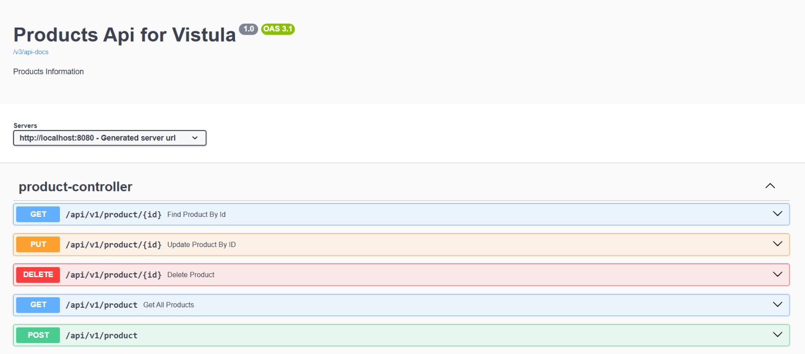
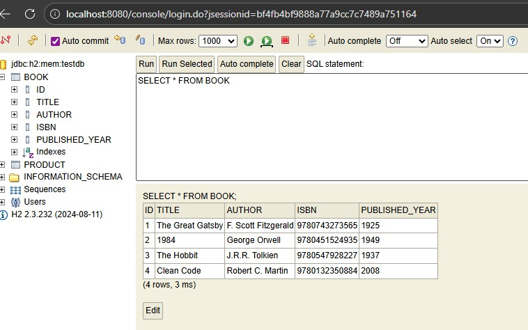

# Book Inventory REST API

This repository features a Spring Boot service for managing a digital library. It provides a clean RESTful interface for Book management, utilizing Spring Data JPA and an in-memory database for rapid development.

## 📸 System Preview

### API Documentation (Swagger)


### Database (H2 Console)


## 🚀 Key Workflows

- **Collection Onboarding**: Use `POST` to register new titles like "The Great Gatsby" or "Clean Code" into the system.
- **Inventory Audit**: Quickly view a live snapshot of all books via the H2 Console or the `GET` endpoint.
- **Library Maintenance**: Seamlessly update book details or remove outdated entries from the catalog using `PUT` and `DELETE`.
- **Safety & Error Handling**: If a user requests a missing ID, the API returns a clear `404 Not Found` JSON message, ensuring system stability.

## 🛠 Tech Stack

- Java 17 & Spring Boot 3
- Spring Data JPA: For database management
- H2 Database: Lightweight, in-memory storage
- Swagger (Springdoc): Interactive API testing
- Maven: Project build tool

3. Explore:
    - Interactive API: http://localhost:8080/swagger-ui.html
    - Live Database: http://localhost:8080/console/

## 📡 API Endpoints

Base Path: `/api/v1/product`

| Method | Endpoint | Action |
|--------|----------|--------|
| `POST` | `/` | Create a new book |
| `GET` | `/` | Retrieve all books |
| `GET` | `/{id}` | Find book by ID |
| `PUT` | `/{id}` | Update book details |
| `DELETE` | `/{id}` | Remove a book |

## 📂 Project Structure
```
src/main/java/com.example.demo
├── model/Book.java                    # The Data Entity
├── repository/BookRepo.java           # Database Queries
├── controller/BookController.java     # API Request Logic
└── exception/GlobalHandler.java       # Error Management
```